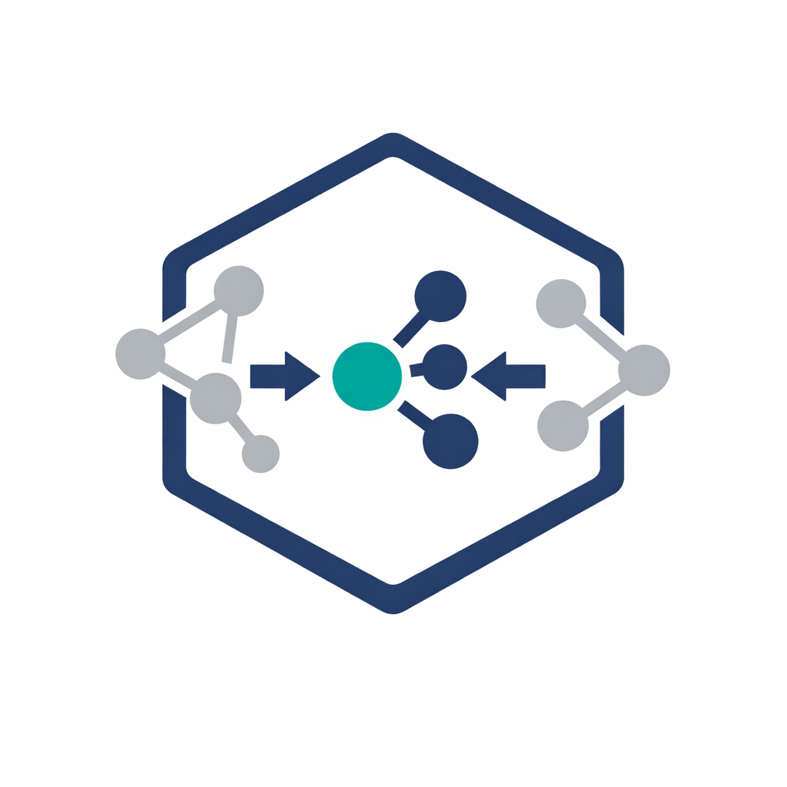

# AsymBench: Benchmarking Framework for Asymmetric Reaction Modelling


<p align="center">
  
</p>

**AsymBench** is a modular, reproducible benchmarking framework for evaluating molecular representations and machine learning models in the prediction of asymmetric reaction outcomes.

It is designed for **research-grade experiments**, enabling systematic comparison of:

- Molecular representations (fingerprints, descriptors, deep learning embeddings, bespoke features)
- Machine learning models (RF, SVR, XGBoost, MLP)
- Data splitting strategies
- Training set sizes
- Random seeds

The framework automatically performs:

- Data loading
- Representation generation
- Feature preprocessing
- Target scaling
- Hyperparameter optimization
- Model training
- Evaluation
- SHAP explainability
- Statistical analysis
- Plot generation
- Reproducible run caching

---

## Key Features

### Reproducible Benchmarking
- Fully configuration-driven experiments via YAML
- Deterministic splits using seeds
- Automatic caching of completed runs (keyed by representation, model, split strategy, and seed)
- Resume interrupted experiments

### Multiple Molecular Representations
- **Morgan fingerprints** (`morgan`)
- **RDKit descriptors** (`rdkit`)
- **CIRCuS descriptors** (`circus`) — corpus-fit, training-set-aware
- **HuggingFace transformer embeddings** (`hf_transformer`) — ChemBERTa, MolT5
- **UniMol embeddings** (`unimol`) — UniMolv1 / UniMolv2
- **Precomputed / bespoke features** (`df_lookup`, `bespoke`, `precomputed`) — loaded from CSV or Parquet by index
- Easily extensible via `BaseSmilesFeaturizer` or `BaseRepresentation`

### Multiple Machine Learning Models
- Random Forest (`random_forest`)
- Support Vector Regression (`svr`)
- XGBoost (`xgb`)
- MLP Regressor (`mlp`)

### Automated Hyperparameter Optimization
- Optuna-based optimization
- Cross-validation on training set only
- Model-specific search spaces
- Fully configurable from YAML

### Advanced Data Splitting
- Powered by [astartes](https://github.com/JacksonBurns/astartes)
- Random split
- Scaffold split
- Target-property-based split
- Train size sweeps
- Multi-seed evaluation
- External test set support

### Built-in Analysis Tools
- Parity plots (train and test)
- SHAP feature importance (train and test)
- Distribution plots
- Statistical tests:
  - Friedman test
  - Pairwise Wilcoxon comparisons

---

## Installation

### 1. Clone the repository
```bash
git clone https://github.com/yourusername/asymbench.git
cd asymbench
```

### 2. Create environment

```bash
conda create -n asymbench python=3.11
conda activate asymbench
```

### 3. Install dependencies

First install poetry to manage the dependencies.

```bash
pip install poetry
```

After that, install the dependencies into the new environment:

```bash
poetry install
```

---

## Quick Start

### 1. Prepare your dataset

Example CSV:
```
substrate_smiles,ligand_smiles,solvent_smiles,ddG
C=CC,O=P(...),CCO,1.23
...
```

### 2. Configure experiment (YAML)
Example:
``` yaml
dataset:
  path: data/DAAA.csv
  smiles_columns: [substrate_smiles, ligand_smiles, solvent_smiles]
  target: ddG
  id_col: Example

representations:
  - type: morgan
    params:
      radius: 2
      n_bits: 2048

models:
  - type: random_forest
    hpo:
      enabled: true
      n_trials: 50
      cv: 3
      scoring: rmse
      search_space:
        n_estimators: {type: int, low: 100, high: 1200}
```

### 3. Run the benchmark

``` bash
python -m benchmarks.run_benchmark --config path/to/config.yaml
```

---

## Run Caching and Reproducibility
Each experiment is uniquely identified by:
- Representation (type + params)
- Model (type)
- Split strategy (sampler, train size, split column)
- Seed

If a run with the same signature already exists and completed successfully, it is loaded from cache instead of recomputed.

This enables:
- Interrupted experiment recovery
- Large-scale benchmarking
- Parallel execution across machines

---

## Output Files

Each completed run writes the following to its run directory:

| File | Contents |
|---|---|
| `predictions.csv` | Train and test rows with `split`, target, predicted target, and all descriptor columns |
| `parity_test.png` | Parity plot for the test set |
| `explainability/train_*.csv` | SHAP values for the training set |
| `explainability/test_*.csv` | SHAP values for the test set |
| `metrics.json` | Evaluation metrics and run metadata |

---

## Adding New Representations

Create a new class inheriting from `BaseSmilesFeaturizer` (for SMILES-based per-molecule featurizers) or `BaseRepresentation` (for any other input format):

```python
# asymbench/representations/my_rep.py
from asymbench.representations.base import BaseSmilesFeaturizer

class MyFeaturizer(BaseSmilesFeaturizer):
    @property
    def feature_dim_per_mol(self) -> int: ...
    def featurize_mol(self, mol) -> np.ndarray: ...
    def feature_names_per_mol(self) -> list[str]: ...
```

Then register it in `asymbench/representations/__init__.py`:

```python
from asymbench.representations.my_rep import MyFeaturizer

def get_representation(config):
    ...
    if rep_type == "my_rep":
        return MyFeaturizer(config)
```

## Adding New Models

Add a branch in `asymbench/models/base.py`:

```python
elif model_type == "my_model":
    _set_if_missing(params, "random_state", seed)
    return MyModel(**params)
```

---

## Citation
Coming soon :)

## License
MIT

## Contact
Eduardo Aguilar: ed.aguilar.bejarano@gmail.com
