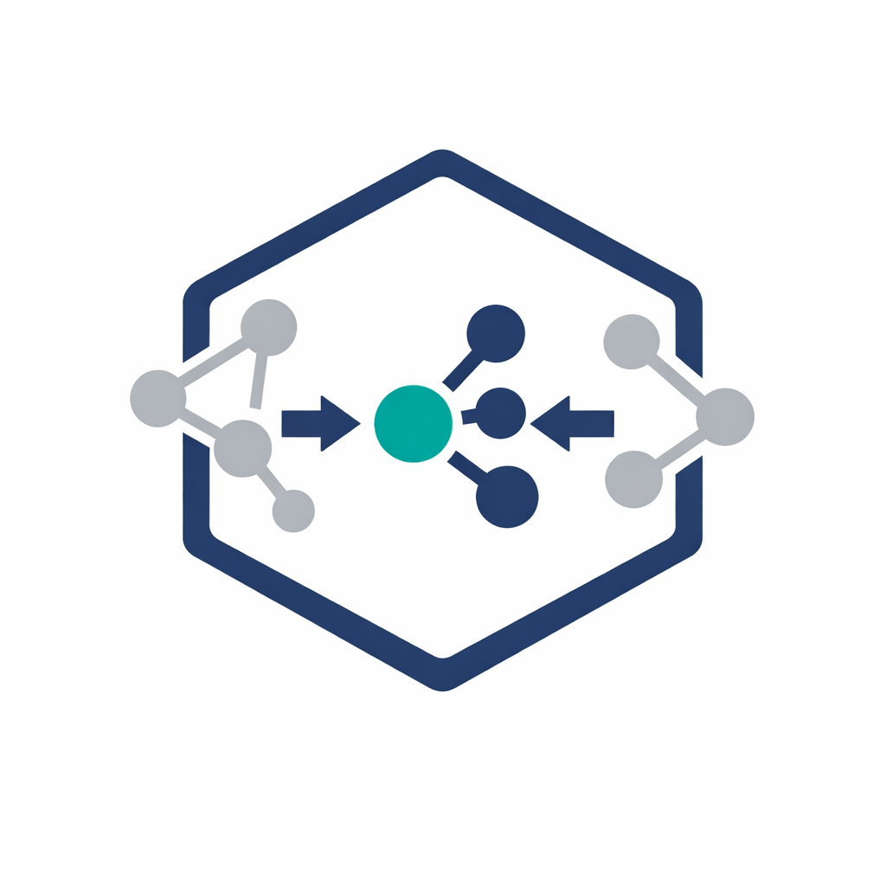

# AsymBench: Benchmarking Framework for Asymmetric Reaction Modelling


<p align="center">
  
</p>

**AsymBench** is a modular, reproducible benchmarking framework for evaluating molecular representations and machine learning models in the prediction of asymmetric reaction outcomes.

It supports systematic comparison of representations (fingerprints, descriptors, deep learning embeddings, graph representations, bespoke features), models (RF, SVR, XGBoost, MLP, GNNs), splitting strategies, training set sizes, and random seeds — all driven by a single YAML config file.

---

## Key Features

- **Configuration-driven** — one YAML file controls the entire experiment
- **Automatic caching** — completed runs are loaded from disk; interrupted benchmarks resume without data loss
- **Reproducible** — all RNGs seeded (Python, NumPy, PyTorch, CUDA)
- **Explainability** — SHAP for traditional ML; Integrated Gradients for GNNs
- **HPO** — Optuna-based cross-validated hyperparameter search per model

### Supported representations

| Key | Description |
|-----|-------------|
| `morgan` | Morgan circular fingerprints |
| `rdkit` | RDKit 2D molecular descriptors |
| `circus` | CIRCuS corpus-fit descriptors (training-set-aware) |
| `hf_transformer` | HuggingFace transformer embeddings (ChemBERTa, MolT5, …) |
| `unimol` | UniMol v1/v2 3D embeddings |
| `bespoke` / `precomputed` / `df_lookup` | Pre-computed features from CSV/Parquet |
| `graph` | Reaction graph for GNNs |

### Supported models

| Key | Description |
|-----|-------------|
| `random_forest` | Random Forest Regressor |
| `svr` | Support Vector Regression |
| `xgb` | XGBoost Regressor |
| `mlp` | Multi-Layer Perceptron |
| `gnn` | GCN / GAT / GIN (via PyTorch Geometric) |

---

## Installation

```bash
git clone https://github.com/EdAguilarB/asymbench.git
cd DAAA_ML_Benchmarking
conda create -n asymmetric_benchmark python=3.11
conda activate asymmetric_benchmark
pip install poetry
poetry install
```

For GPU support see [docs/gnns.md](docs/gnns.md#gpu-setup).

---

## Quick Start

1. Place your data:
```
data/my_reaction/
    ├── reactions.csv
    └── bespoke_features.csv   # optional
```

2. Create a config:
```
benchmarks/my_reaction/benchmark_config.yaml
```

3. Run:
```bash
python -m benchmarks.run_benchmark --config benchmarks/my_reaction/benchmark_config.yaml
```

Results are written to the directories specified in `log_dirs`.

---

## Input Data Format

The dataset must be a CSV where each row is one reaction, with SMILES columns for each molecular component and a numeric regression target:

```
id,substrate_smiles,ligand_smiles,solvent_smiles,ddG
1,O=C1C(C(OCC=C)=O)(c2ccccc2)CCC1,O=P1(O)Oc2ccccc2-c2ccccc21,ClCCl,-6.11
```

Reaction/experimental variables (temperature, time, …) can be kept as additional columns and referenced via `reaction_features` in the YAML.

---

## Documentation

| Topic | File |
|-------|------|
| Full YAML reference + representation names | [docs/configuration.md](docs/configuration.md) |
| GNN architectures, parameters, GPU setup | [docs/gnns.md](docs/gnns.md) |
| SHAP & Integrated Gradients explainability | [docs/explainability.md](docs/explainability.md) |
| Output files, run caching, extending the framework | [docs/output_and_caching.md](docs/output_and_caching.md) |

---

## Citation

If you use AsymBench in your research, please cite:

> Aguilar-Bejarano, E.; Galvin, D.; Rogers, D. M.; Özcan, E.; Woodward, S.; Guiry, P. J.; Figueredo, G.
> **Benchmarking molecular representations and machine learning algorithms for asymmetric catalysis: a palladium-catalysed decarboxylative asymmetric allylic alkylation case study.**
> *Journal of Cheminformatics* **18**, 120 (2026).
> https://doi.org/10.1186/s13321-026-01236-z

```bibtex
@article{aguilarbejarano2026asymbench,
  author  = {Aguilar-Bejarano, E. and Galvin, D. and Rogers, D. M. and Özcan, E. and Woodward, S. and Guiry, P. J. and Figueredo, G.},
  title   = {Benchmarking molecular representations and machine learning algorithms for asymmetric catalysis: a palladium-catalysed decarboxylative asymmetric allylic alkylation case study},
  journal = {Journal of Cheminformatics},
  volume  = {18},
  pages   = {120},
  year    = {2026},
  doi     = {10.1186/s13321-026-01236-z},
  url     = {https://doi.org/10.1186/s13321-026-01236-z}
}
```

---

## License

MIT

## Contact

Eduardo Aguilar: ed.aguilar.bejarano@gmail.com
